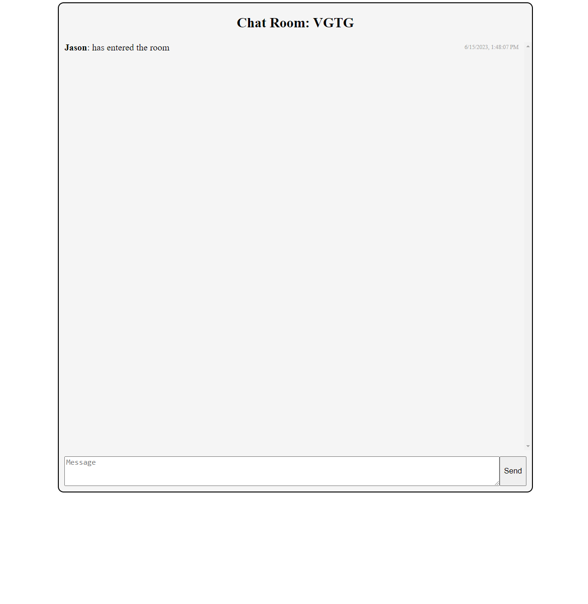

# Chatroom
The Chatroom project is a real-time chat room system implemented using the Python Flask framework and Socket.IO. This chat application allows users to communicate with each other in real-time, exchanging text messages instantly.

## Features
- Real-time messaging: Users can send and receive messages in real-time without the need to refresh the page.
- Multiple chat rooms: Users can join different chat rooms to communicate with specific groups of people.
- User behavior indicators: Users' online/offline behavior is displayed in chat, allowing others to see who is join or leave.

## Technologies
- Python
- Flask
- SocketIO
- HTML
- CSS
- JavaScript

## Screenshot
- main page

- room

